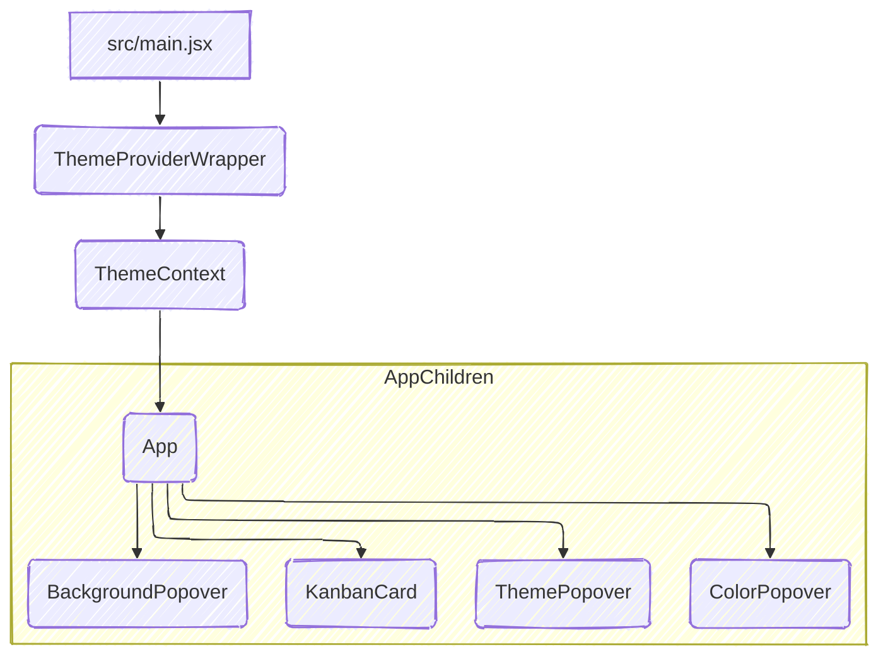
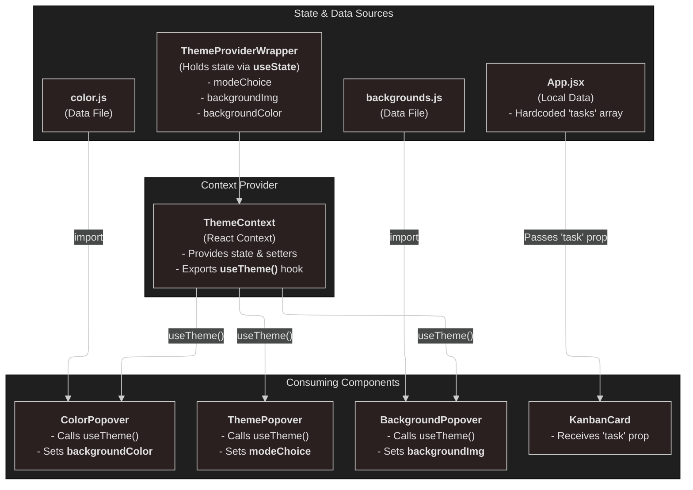

# "Component Structure GlassMorphicTheme"

```mermaid
---
config:
  theme: default
  layout: elk
  look: handDrawn
---
flowchart TB
 subgraph AppChildren["AppChildren"]
        E("KanbanCard")
        D("App")
        F("ThemePopover")
        G("BackgroundPopover")
        H("ColorPopover")
  end
    A["src/main.jsx"] --> B("ThemeProviderWrapper")
    B --> C("ThemeContext")
    C --> D
    D --> E & F & G & H


```

# STATE and DATA flow chart

```mermaid
---
config:
  theme: neo-dark
  layout: elk
---
flowchart TB
 subgraph subGraph0["State & Data Sources"]
    direction TB
        A["<b>ThemeProviderWrapper</b><br>(Holds state via <b>useState</b>)<br>- modeChoice<br>- backgroundImg<br>- backgroundColor"]
        B["<b>backgrounds.js</b><br>(Data File)"]
        C["<b>color.js</b><br>(Data File)"]
        D@{ label: "<b>App.jsx</b><br>(Local Data)<br>- Hardcoded 'tasks' array" }
  end
 subgraph subGraph1["Context Provider"]
        P["<b>ThemeContext</b><br>(React Context)<br>- Provides state &amp; setters<br>- Exports <b>useTheme()</b> hook"]
  end
 subgraph subGraph2["Consuming Components"]
        H["<b>ThemePopover</b><br>- Calls useTheme()<br>- Sets <b>modeChoice</b>"]
        I["<b>BackgroundPopover</b><br>- Calls useTheme()<br>- Sets <b>backgroundImg</b>"]
        J["<b>ColorPopover</b><br>- Calls useTheme()<br>- Sets <b>backgroundColor</b>"]
        K@{ label: "<b>KanbanCard</b><br>- Receives 'task' prop" }
  end
    A --> P
    P -- useTheme() --> H & I & J
    B -- import --> I
    C -- import --> J
    D -- Passes 'task' prop --> K
    D@{ shape: rect}
    K@{ shape: rect}


```
